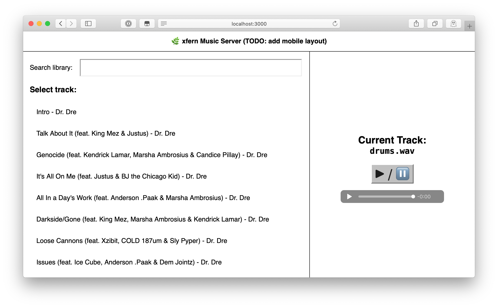

# xfern



An open-source media server that has two goals:

1. Don't fall prey to commercial interests ([the freedom to change a program, so that you can control it instead of it controlling you](https://en.wikipedia.org/wiki/The_Free_Software_Definition#The_Four_Essential_Freedoms_of_Free_Software))
2. Don't aim to be anything more than be the best music server possible ([Worse is better](https://en.wikipedia.org/wiki/Worse_is_better))

## xfern philosophy

It's your music. 
<br/>
It's your features.
<br/>
It's your data.

No subscriptions.
<br/>
No tracking.
<br/>
No restrictions.

## License

This project is licensed under the [Mozilla Public License 2.0](https://choosealicense.com/licenses/mpl-2.0/).

See the `LICENSE` file for more.

`media/drums.wav` sample file by `alexround` via [freesound](https://freesound.org/people/alexround/sounds/538087/).

## How to use xfern

The ideal use-case is:

* Add your music files to a computer you own
* Download the source code and compile it
* Run the server on that computer within your LAN
* Play music from it on any of your devices without signups, tracking or limits

## What if I want extra functionality?

xfern supports a great event-based plugin system where you can build your own integrations and
functionality. 

Want automatically-downloaded album art? Make a plugin! 

Want `last.fm` tracking? *Make a plugin!!*

Want visual lyrics sync? **Make a plugin!!!**

## Developing

You'll need the following:

1. `Yarn`
2. A modern browser
3. Some music files!

To setup everything, run:

```bash
cd path/to/xfern
yarn install
```

Then add some `.mp3` (or other supported formats) to the `/media` folder in any
directory structure that suits you.

Then to run the development server:

```bash
yarn start
```

This will start the xfern server on port 3000 (the UI) and port 3001 (the API).

